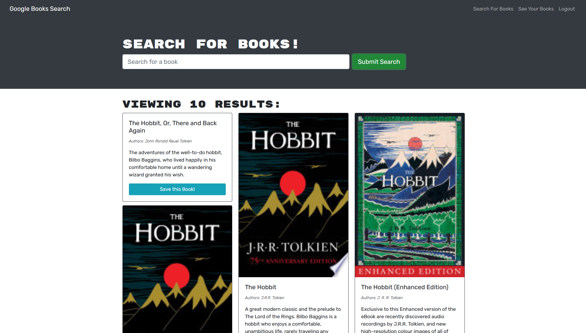

# Description

In this assignment, our task was to take starter code with a fully functioning Google Books API search engine built with a RESTful API, and refactor it to be a GraphQL API built with Apollo Server. The app was built using the MERN stack with a React front end, MongoDB database, and Node.js/Express.js server and API.

To update the application, we needed to do the following:

1. Set up an Apollo Server to use GraphQL queries and mutations to fetch and modify data, replacing the existing RESTful API.

2. Modify the existing authentication middleware so that it works in the context of a GraphQL API.

3. Create an Apollo Provider so that requests can communicate with an Apollo Server.

4. Deploy the application to Heroku with a MongoDB database using MongoDB Atlas.

Users are able to create a login, search for books and save them to their profile.

This application uses the following npm packages:

- [@apollo/client](https://www.npmjs.com/package/@apollo/client)
- [@testing-library/jest-dom](https://www.npmjs.com/package/@testing-library/jest-dom)
- [@testing-library/react](https://www.npmjs.com/package/@testing-library/react)
- [@testing-library/user-event](https://www.npmjs.com/package/@testing-library/user-event)
- [apollo-server-express](https://www.npmjs.com/package/apollo-server-express)
- [bcrypt package](https://www.npmjs.com/package/bcrypt)
- [bootstrap](https://www.npmjs.com/package/bootstrap)
- [concurrently](https://www.npmjs.com/package/concurrently)
- [express](https://www.npmjs.com/package/express)
- [graphql](https://www.npmjs.com/package/graphql)
- [jsonwebtoken](https://www.npmjs.com/package/jsonwebtoken)
- [jwt-decode](https://www.npmjs.com/package/jwt-decode)
- [mongoose](https://www.npmjs.com/package/mongoose)
- [react](https://www.npmjs.com/package/react)
- [react-bootstrap](https://www.npmjs.com/package/react-bootstrap)
- [react-dom](https://www.npmjs.com/package/react-dom)
- [react-router-dom](https://www.npmjs.com/package/react-router-dom)
- [react-scripts](https://www.npmjs.com/package/react-scripts)

HTML | CSS | JavaScript | Node.js | React | Apollo Server | MongoDB

# Screenshot

